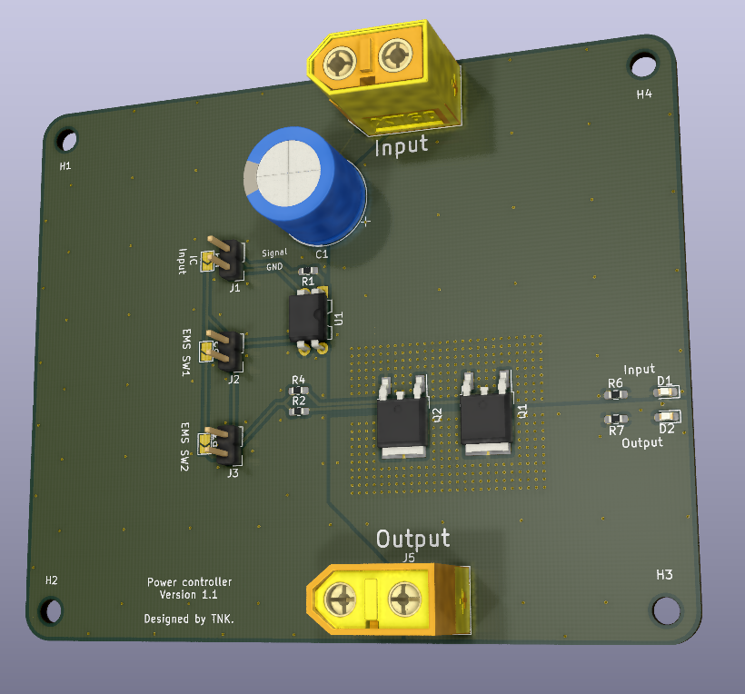
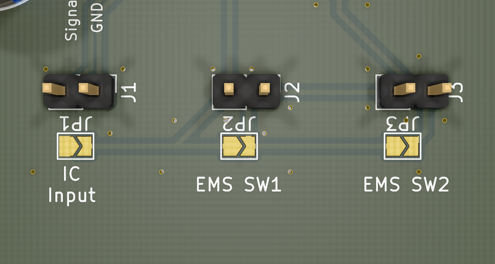
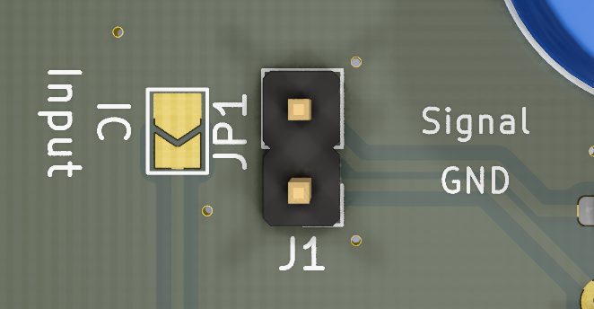
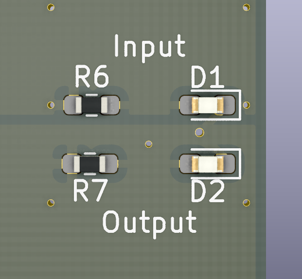

# PowerControl

## 機能の説明
本基板は、電源の制御回路です。

最大3つのスイッチを用いて電源のON/OFF制御ができます。

常時許容電流は70A程度です(使用する環境やMOSFETの性能によって低下します)。

各スイッチはAND構成で接続しているため、全てのスイッチがONになったときのみ電流が流れます。

## 使い方

### スイッチの構成

本基板には3つのスイッチを接続するコネクタが用意されています。

スイッチの構成は以下です。

| リファレンス | 基板上の表記 | 対象スイッチ      | ON               | 対応ソルダジャンパ |
| ------------ | ------------ | ----------------- | ---------------- | ------------------ |
| J1           | IC Input     | マイコン等の入力  | フォトカプラがON | JP1                |
| J2           | EMS SW2      | 非常停止スイッチ2 | スイッチがON     | JP2                |
| J3           | EMS SW1      | 非常停止スイッチ1 | スイッチがON     | JP3                |

動作チェック時など、一部のスイッチを接続しない場合は、接続しないスイッチの真下のソルダジャンパ(JP1~JP3)をショートすることで接続を省略することができます。

### スイッチの接続

#### IC Input

信号を絶縁するため、フォトカプラを通して電源を制御します。

Signal側のピンにマイコンの5Vや3.3V等の出力を入力、GND側にマイコンが使用しているGNDを入力してください。

#### EMS SW

非常停止スイッチ接続用のため、極性などは気にする必要はありません。

## 確認用LED

入力側と出力側の両方のON/OFF確認用LEDを用意しています。

LEDが点灯している場合ONの状態です。

LEDを実装する場合は、入力側と出力側で異なる色のLEDにすると状態を視認しやすくなると思います。

